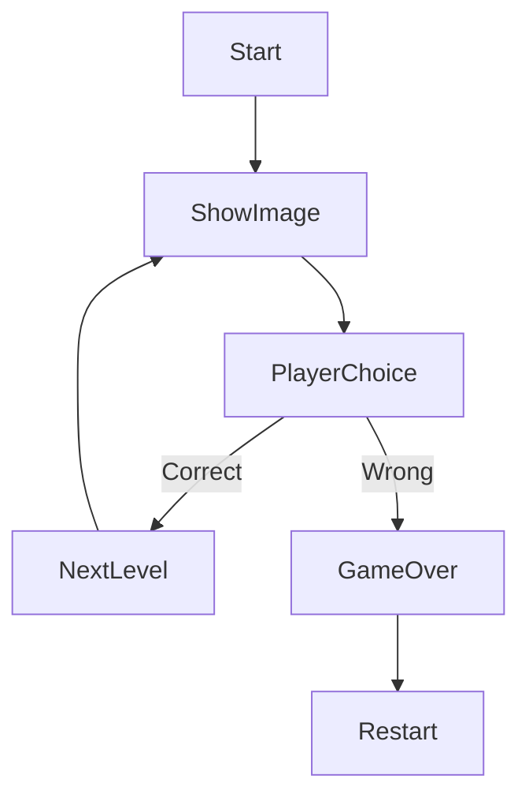

# 🧠 Reality vs Illusion 🎮


---

## 🎯 Project Overview

👁️ Can your brain tell the difference between **Reality** and **Illusion**?

This is a fast-paced interactive web game where players must quickly decide whether an image is **real** or an **optical illusion**.

⚡ One wrong move… and it’s GAME OVER.

---

## 🚀 Features

✨ 🖼️ Random Image Generator
✨ 🎯 Real vs Illusion Decision System
✨ 📊 Live Score Tracking
✨ 📈 Level Progression
✨ ❌ Instant Game Over on Mistake
✨ 🔁 Restart Option

---

## 🎮 Gameplay



---

## 🧠 Game Logic

| 🔍 Element | 💡 Description          |
| ---------- | ----------------------- |
| Image      | Randomly displayed      |
| Choice     | REAL or ILLUSION        |
| Correct    | Score + Level increases |
| Wrong      | Game ends               |

---

## 🛠️ Tech Stack

| 💻 Tech    | 🔧 Role                |
| ---------- | ---------------------- |
| HTML       | Structure              |
| CSS        | Styling (UI + Effects) |
| JavaScript | Game Logic             |

---

## 📂 How to Run

```bash id="c4l9ts"
1. Copy the code  
2. Save as illusion-game.html  
3. Open in browser  
4. Start playing 🎮
```

---

## 🏆 Scoring System

🟢 Correct Answer → +1 Score
🔴 Wrong Answer → Game Over

🎯 Challenge yourself to beat your **highest score!**

---

## 🔥 Future Enhancements

🚀 Add sound effects & background music
🚀 Add timer mode ⏳
🚀 Add leaderboard system 🏆
🚀 Add difficulty levels (easy / hard / insane)
🚀 Add real illusion dataset 🧠

---

## 👨‍💻 Author

💡 Created by: **Yash Pathrikar**
🎯 Project Type: Interactive Web Game

---

## ⭐ Support

If you like this project:
🌟 Star it
📢 Share it
💬 Give feedback

---

## 🧩 Final Thought

> “Your eyes see… but your brain decides.” 👁️🧠

---
